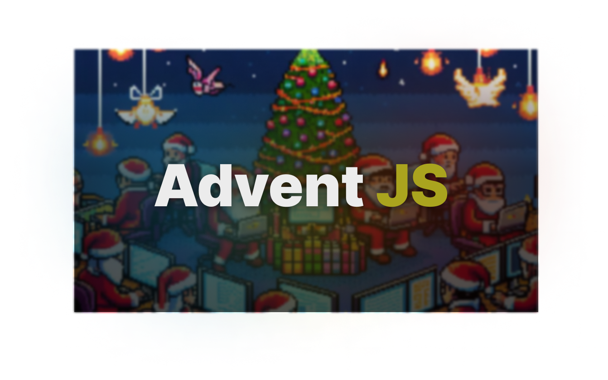

# adventjs-2023

Este repositorio contiene 25 katas diarias realizadas por Midudev como parte del evento AdventJS 2023.

# ¿Qué es AdventJS?

AdventJS es un evento anual donde los desarrolladores de JavaScript de todo el mundo se reúnen para resolver un desafío de programación cada día durante el mes de diciembre. Cada día se publicará una nueva kata que pondrá a prueba tus habilidades de programación en JavaScript.

## ¿Cómo participar?

Para participar en AdventJS 2023, busca https://adventjs.dev/ y resuelve los problemas

### Contacto

Si tienes alguna pregunta o comentario sobre AdventJS 2023, puedes contactar a Midudev a través de Twitter.

¡Gracias por participar en AdventJS 2023! Esperamos que disfrutes resolviendo las katas diarias y aprendas algo nuevo en el proceso. Si tienes alguna otra pregunta, no dudes en hacerla.
